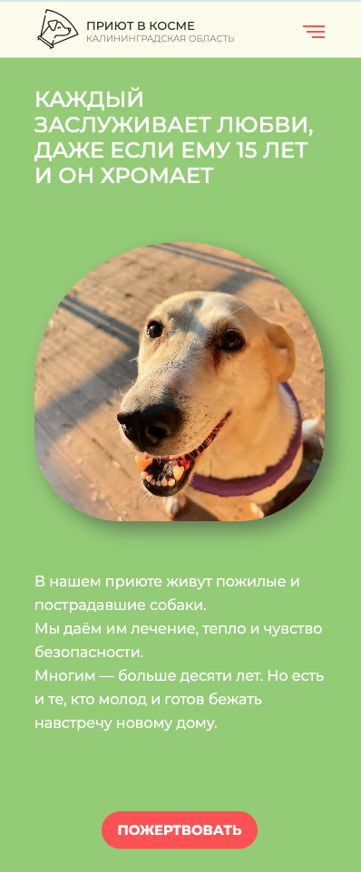
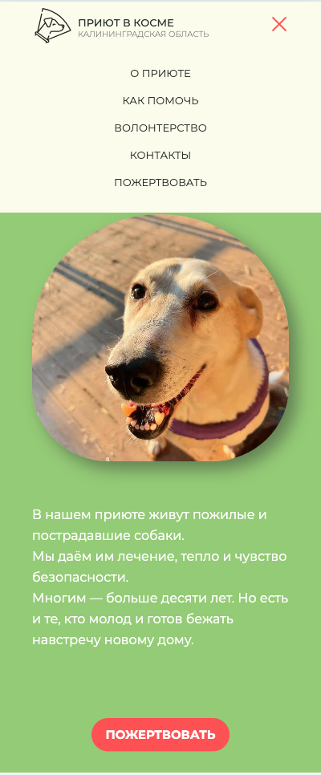

# Приют в косме

---

## Описание

Адаптивный одностраничный сайт приюта для собак в калининградской области.
Цель сайта — рассказать о приюте и способах помочь его питомцам.

## О проекте

Сайт реализован на препроцессоре Sass. В проекте были использованы следующие технологии:

- Flexbox
- JS

В проекте есть анимация наведения курсора на кнопки

Также в нем есть рабочая навигация по разделам страницы

Для удобства пользователей реализованы:

- липкий header;
- pop-up;
- возможность нажатием копировать реквизиты для перевода.

Этот сайт отображается корректно при всех разрешениях от 320px до 1440px и выше. Для разрешений 1159px и менее реализовано гамбургер-меню.

## Что сделали:

- [x] Современный дизайн
- [x] Адаптивную валидную кроссбраузерную верстку
- [x] Простая навигация и интуитивно понятная структура

## Команда проекта

[Томара](https://github.com/Glazunovatomara) - header, pop-up, блок "О приюте"

[Ирина](https://github.com/lrina7) - блок "Как можно помочь приюту”

[Ирина](https://github.com/Black8Jade) - блок "Волонтерство",блок "Взять собаку домой", footer

## Результат
